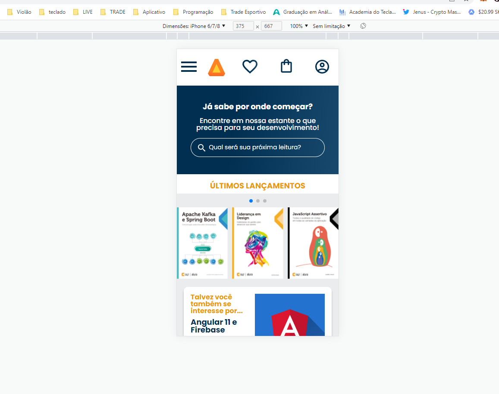

# responsividade com mobile-first

Esta é uma solução para o curso do Alura. Os desafios do curso ajudam você a melhorar suas habilidades de codificação criando projetos realistas.

## Índice

- [Visão geral](#visão-geral)
  - [O desafio](#the-challenge)
  - [Captura de tela](#captura-de-tela)
  - [Links](#links)
- [Meu processo](#meu-processo)
  - [Construído com](#construído-com)
  - [O que aprendi](#o-que-aprendi)
  - [Desenvolvimento contínuo](#desenvolvimento-contínuo)
- [Autor](#autor)
- [Agradecimentos](#agradecimentos)


## Visão geral

### O desafio

Os alunos devem ser capazes de:

- Construir um site com HTML e CSS
- Entender como interpretar um protótipo de site criado no Figma
- Conhecer a abordagem mobile-first
- Aprender a utilizar media queries na construção de layouts responsivos
- Realizar o deploy de um site

### Captura de tela



### Links

- URL da solução: [Github](https://github.com/guhmonarin/responsividade-com-mobile-first)
- URL do site ao vivo: [Vercel](https://responsividade-com-mobile-first.vercel.app/)

## Meu processo

### Construído com

- HTML5 
- CSS
- Flexbox

### O que eu aprendi

Neste projeto do curso aprendi e reforcei alguns conhecimentos, como:
- Desenvolver um menu hambúrguer interativo com HTML e CSS;
- Aplicar plugins externos através de CDN;
- Utilizar o plugin SwiperJS;
- Reforçar o aprendizado de flexbox;

``` css
.cabecalho__menu-hamburguer {
    width: 24px;
    height: 24px;
    background-image: url(../img/Menu.svg);
    background-repeat: no-repeat;
    background-position: center;
    display: inline-block;
}

.cabecalho {
    background-color: var(--branco);
    display: flex;
    justify-content: space-between;
    align-items: center;
    position: relative;
}

.container {
    display: flex;
    align-items: center;
}

.container__imagem {
    padding: 1em;
}

.lista-menu {
    display: none;
    position: absolute;
    top: 100%;
    width: 60vw;
}

.container__botao:checked ~ .lista-menu {
    display: block;
    
}

.lista-menu__titulo, 
.lista-menu__item {
    padding: 1em;
    background-color: var(--branco);
}

.lista-menu__titulo {
    color: var(--laranja);
    font-weight: 700;
}

.lista-menu__link {
    background: var(--azul-degrade);
    -webkit-background-clip: text;
    -webkit-text-fill-color: transparent;
    background-clip: text;
    text-transform: uppercase;
}

.container__botao {
    display: none;
}

```

```js
const swiper = new Swiper('.swiper', {
            speed: 400,
            spaceBetween: 10,
            slidesPerView: 3,
            pagination: {
            el: '.swiper-pagination',
            type: 'bullets'}
      });
```

### Desenvolvimento contínuo

Continuo melhorando o meu desempenho no uso do flexbox, e usar design responsivos para o site funcionar em vários tipos de tela. E neste curso adquiri a habilidade de começar o projeto utilizando mobile-first, e depois passando para o layout de tablet, e depois para desktop. 

## Autor

- Linkedin - [Gustavo Monarin](https://www.linkedin.com/in/gustavo-monarin-652672127/)
- Github - [Gustavo Monarin](https://github.com/guhmonarin)